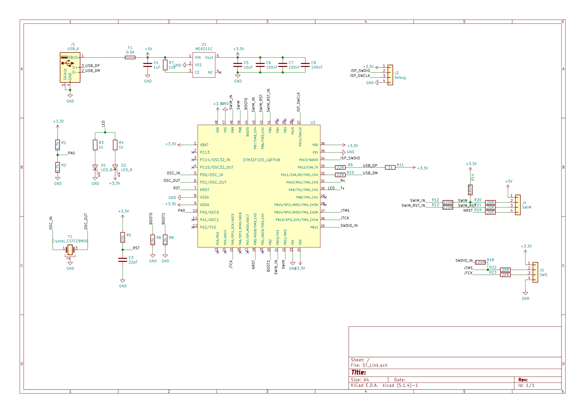
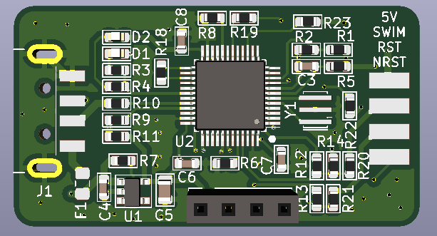
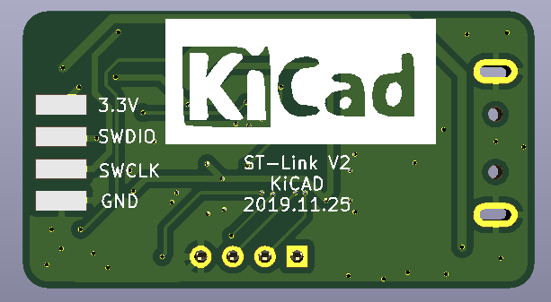

# STLink V2  Designed with KiCAD

## 说明  
本工程为Kicad工程，里面提供改硬件对应固件。使用说明请往下看。    

## 使用说明:
1.通过别的下载器将固件烧录进去。烧录成功后插入电脑能检测到stlink设备。   
2.打开stm32 ST-Link Utility.选择 ST-Link -> Firmware update 刷路最新固件。(这里通过usb更新固件,并非通过别的下载器更新)。    
3.完毕。 

## 原理图
 

## 效果图   
   
   

## 友情广告
PCB设计推荐软件Kicad，功能强大，开源免费,免除律师函警告。       
QQ群:924407324